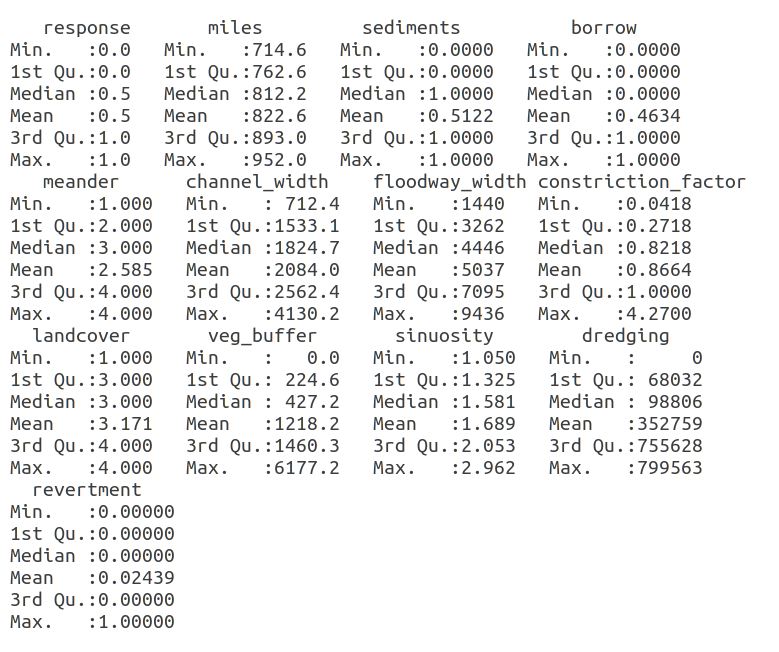
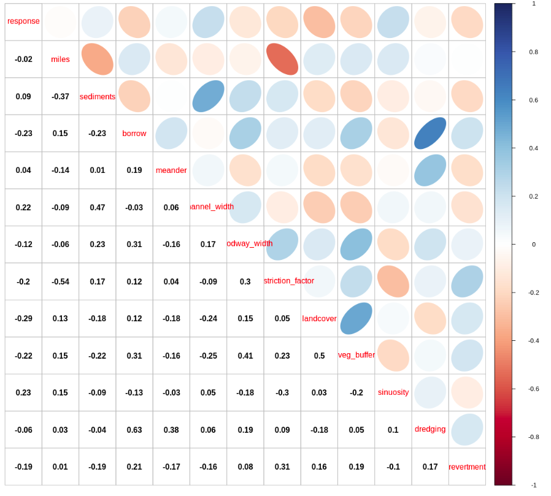
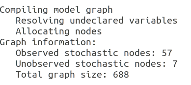
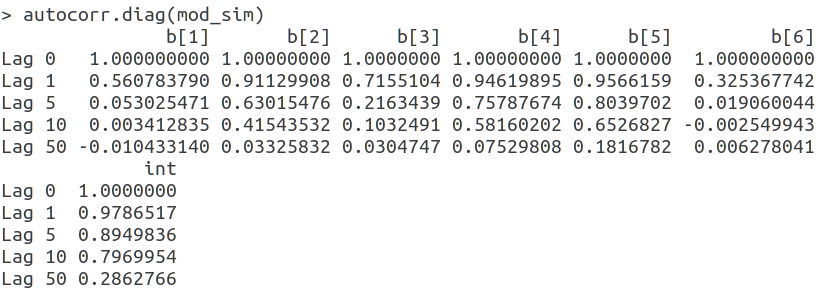
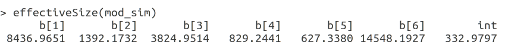
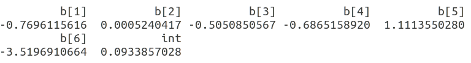
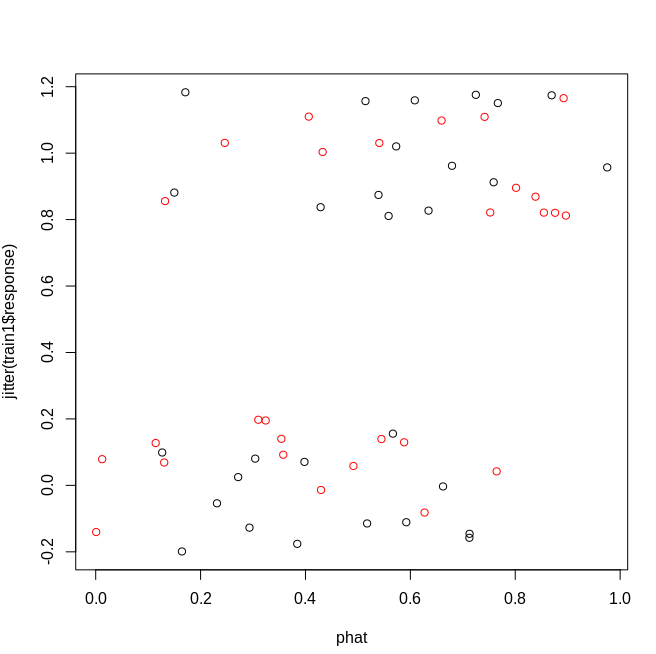
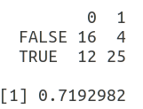
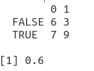

# levee-failure-detection
### ABSTRACT
This report summarizes the relative importance of geologic, geomorphic, and other physical factors
that have led to levee failures through the past century along much of the Mississippi River. Logistic
regression model has been used to predict failure. The data is available publicly at datasets. The
investigation started first by exploring the data and selecting the meaningful predictor variables
using variable selection techniques, to avoid underfitting/overfitting. After training the logistic
model with the training dataset, it gives around 72% training accuracy and 60% test accuracy.

### INTRODUCTION
A levee breach or levee failure is a situation where a levee fails or is intentionally breached, causing
the previously contained water to flood the land behind the levee. Several geologic, geomorphic and
other physical factors are responsible for it. In this project we will predict these failures based on
past failure data. Binary output suggests to use a logistic regression model for prediction.

### DATA

#### DATA SUMMARY
The response variable indicates the levee failure(1 for failure). miles represent the length of river in
miles, sediments indicates Site underlain by coarse-grain channel fill, borrow indicates whether the
river is borrow pit or NOT, meander indicates Meander location (1=Inside bend, 2=outside bend,
3=chute, 4=straight), landcover indicates land cover type (1=open water, 2=grassy, 3=agricultural,
4=forest), veg_buffer is the vegetation buffer width, dredging is the dredging intensity, and
revertment is bank revetement.

#### PLOT
The plot below depicts the correlation among the predictor variables.

From the above plot it is quite evident that the data is not heavily correlated.

#### VARIABLE SELECTION 
For variable selection, we have used a linear model where the priors for
the β coefficients favor values near 0 (indicating a weak relationship). This way, the burden of
establishing association lies with the data. If there is not a strong signal, we assume it doesn’t exist.
We have chosen double exponential( or Laplace) distribution as a prior for β.

### MODEL
We will fit a Bayesian logistic model. Based on the variable selection, following predictor variables
are selected, written alongside with their coefficients-

● int : intercept

● b[1] : borrow

● b[2] : channel_width

● b[3] : constriction_factor

● b[4] : landcover

● b[5] : sinuosity

● b[6] : revertment

Now we’ll initialize the model and run the MCMC sampler :

Using Bernoulli likelihood, with normal prior on the coefficients of logit function, with 1,000 Burn-in
iterations and 30,000 total iterations for 3 chains, we get the following autocorrelation diagnostics.

Here, we can see that not all the parameters have converged, giving following sample size :

However, we are interested in means of these coefficients which are :

The scatter plot of predicted values vs actual outcome shown below gives a rough idea of how
successful the model is :

### RESULT
After optimization, the model accuracy becomes maximum at a threshold of 0.4.
For Training dataset :                  

 71.93% For Test dataset : 60%
 
 
 
 ### CONCLUSION
 The logistic model is used to model the probability of a certain class or event existing, such as
pass/fail, win/lose, alive/dead, or healthy/sick. These models' unique ability to predict binary
outcomes led us to use this model for our problem. However, the accuracy of the model doesn't
seem satisfactory. Though there could be many reasons, the primary issue appears to be with the
data. The features used may not be sufficient enough to predict the failure. Increasing the data
points may also improve accuracy to some extent. Efforts must be made to explore new features
that can explain the failure process entirely to predict these disasters in advance.
